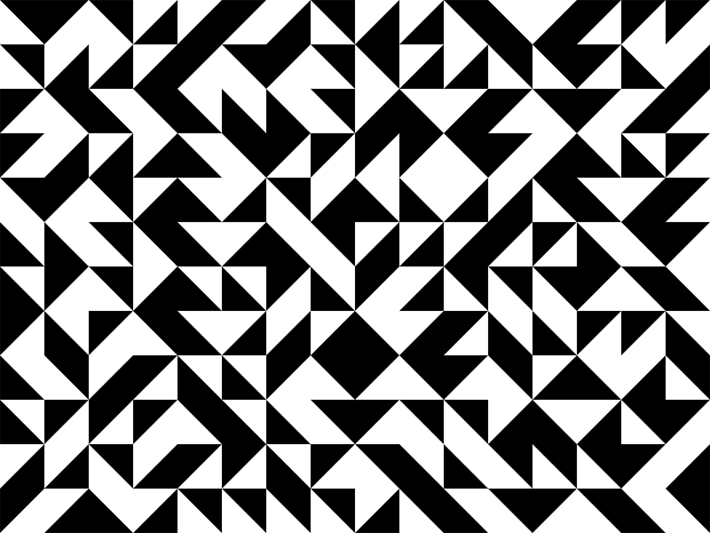

# Truchet Tiles.
*Arduino | Feather M0 Cortex & ILI9340 Breakout board*

Truchet tiles are square tiles decorated with patterns that are not rotationally symmetric. When placed within a square tiling of the plane, they can form varied patterns, and the orientation of each tile can be used to visualize information associated with the tile's position within the tiling.

Truchet tiles were first described in a 1704 memoir by Sébastien Truchet entitled "Mémoire sur les combinaisons", and were popularized in 1987 by Cyril Stanley Smith.

## Board & Wiring

The display and control use off-the-shelf parts from [Adafruit](https://www.adafruit.com/), and is assumed that you've already installed any drivers, libraries for the Feather board and ILI9340 breakout board.  
##### Hardware
* [2.2" 18-bit color TFT LCD display with microSD card breakout](https://www.adafruit.com/product/1480)
* [Adafruit Feather M0 Basic Proto - ATSAMD21 Cortex M0](https://www.adafruit.com/product/2772)
* [Potentiometer](https://en.wikipedia.org/wiki/Potentiometer)
##### Libraries

* [Adafruit_GFX](https://github.com/adafruit/Adafruit-GFX-Library)
* [Adafruit_ILI9341](https://github.com/adafruit/Adafruit_ILI9341)

### Feather

| ILI9340 Breakout | Feather M0 Board  | Potentiometer |
| ------ | ------ | ---- |
| sck | sck |
| miso | miso |
| mois | mois |
| cs | 10 |
| d/c | 9 |
| rst| rst |
| gnd | gnd | gnd
| vin | 3v | 3v
|  | A0 | vin